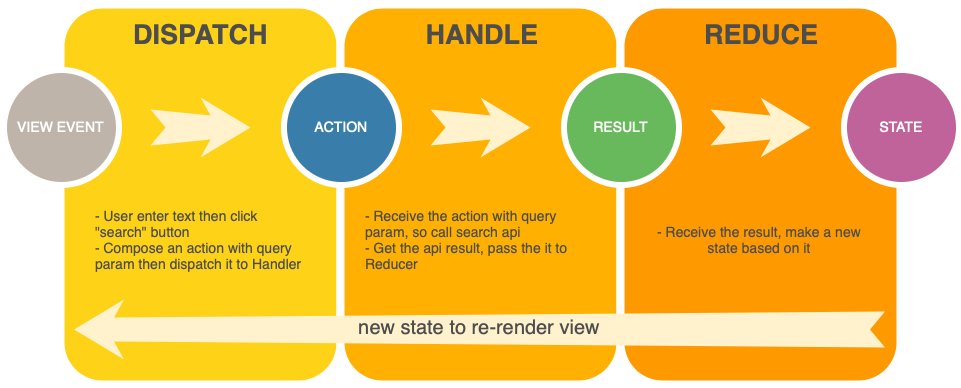

# ToDo Sample App
Todo sample app built with MVI .

[](https://opensource.org/licenses/Apache-2.0)
  <center>


<br>
</center>

## MVI Pattern
<center>

<br>
Fig. MVI in Nutshell ([image](https://medium.com/@thanh.bm/android-mvi-architecture-with-livedata-c72e9e1bd3e6))
</center>

## Single Event Management

The single event management in mvi has always been a debatable question.
I'm using this simple class to handle single event.

```kotlin
class SingleEvent<T>(value: T? = null) {
    private var _value: T? = null

    val value: T?
        get() {
            val tmp = _value;
            _value = null
            return tmp
        }

    init {
        _value = value
    }
}

```
And I'm using it as:

```kotlin

data class UIState(toast:SingleEvent<String>) // state class


stateRelay.subscribe{state-> // state observable

    state.toast.value?.let{ showToast(it) }

}

```


## Useful Resources
 -  [Managing State with RxJava](https://www.youtube.com/watch?v=0IKHxjkgop4) by [@JakeWharton ](https://github.com/JakeWharton)
  - [How to cook a well-done MVI for Android
](https://www.youtube.com/watch?v=Ls0uKLqNFz4) by [@colriot](https://github.com/colriot)
  - [MVICore](https://github.com/badoo/MVICore) by [@badoo](https://github.com/badoo)


## Bugs and Feedback
 I made this app while I was playing around with mvi pattern. I am by no means expert and this implementation is not perfect.

For bugs, questions and discussions please use the [Github Issues](https://github.com/psuzn/mvi-demo/issues/new).

## License
```
Copyright 2020 @psuzn

Licensed under the Apache License, Version 2.0 (the "License");
you may not use this file except in compliance with the License.
You may obtain a copy of the License at

    http://www.apache.org/licenses/LICENSE-2.0

Unless required by applicable law or agreed to in writing, software
distributed under the License is distributed on an "AS IS" BASIS,
WITHOUT WARRANTIES OR CONDITIONS OF ANY KIND, either express or implied.
See the License for the specific language governing permissions and
limitations under the License.
```